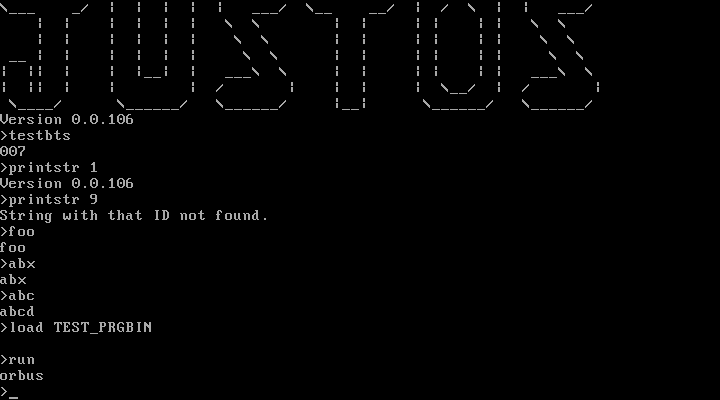
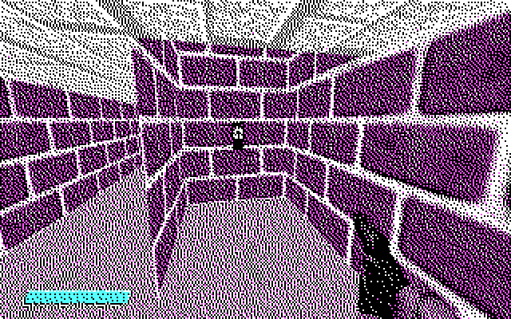

# JustOS — decompiled

A reconstruction of **JustOS "Version 0.0.106"** and its programs from the two
floppy images in `Bin/`. Every binary rebuilds **byte-for-byte identical** to the
original:

```
$ ./build.sh
  identical  bootload.bin
  identical  KERNEL.BIN
  identical  TEST_PRG.BIN
  identical  IMGVIEW.BIN
  wrote      Build/justos-full.img
```

You need `nasm` and `python3`. To run the result:
`qemu-system-i386 -drive file=Build/justos-full.img,if=floppy,format=raw`



## Layout

| Path | What it is |
|---|---|
| `Bin/JustOS.img` | Original boot floppy: boot sector, `KERNEL.BIN`, `GF.PIC` |
| `Bin/disk.img` | Original data floppy (made by `mkfs.fat`, not bootable): `TEST_PRG.BIN`, `IMGVIEW.BIN`, `THEMESS.PIC` |
| `Source/boot/bootload.asm` | Boot sector (512 B) |
| `Source/kernel/kernel.asm` | Kernel + shell (2151 B) |
| `Source/programs/justos.inc` | Program interface: syscall vectors, header macro |
| `Source/programs/test_prg.asm` | `TEST_PRG.BIN` (40 B) |
| `Source/programs/imgview.asm` | `IMGVIEW.BIN` (129 B) |
| `Tools/fat12.py` | List/extract/build FAT12 floppy images (no mtools needed) |
| `Tools/pic2png.py` | Convert `.PIC` images to PNG |
| `build.sh` | Assemble everything, compare with `Bin/`, build a bootable floppy |

All sources build with `nasm -O0`. The originals were assembled without
optimisation: immediates use long forms, and every unconditional `jmp` is near.
The names of labels and variables are my reconstruction. Bytes, layout and
behaviour match the original exactly.

## Boot process

1. **Boot sector** (`JUSTBOOT` OEM ID, volume label `JUSTOS`). This is the
   MikeOS 4.x FAT12 loader, instruction for instruction. It reads the root
   directory and the FAT into 07C0:0200, finds `KERNEL  BIN`, loads it to
   **2000:0000**, and jumps there with DL = boot drive.
2. **Kernel** sets SS:SP = 0000:FFFF, sets DS = ES = FS = GS = 2000h and turns
   off text blinking (INT 10h/1003h). It hooks **INT 08h** (the timer) so that a
   tick counter goes up, then prints the logo and version and starts the shell.

## Memory map (segment 2000h = kernel)

| Offset | Contents |
|---|---|
| `0000–0023` | Syscall vector table (below) |
| `0024–04A8` | Code |
| `04A9` | `file_struct`: 11-char 8.3 name + 0, then **`load_segment` at +0Ch (`04B5`, default 3000h)** |
| `04E6–04F0` | `bootdev`, `cluster`, `pointer` (load offset), `Sides`=2, `SecsPerTrack`=18, `RootDirEntries`=224 |
| `04F1` | `"Version 0.0.106"` |
| `0501` | ASCII-art logo |
| `0760` | Command line buffer (256 B) |
| `0861` | Command length (byte) |
| `0862` | Number buffer `"000",0` |
| `0866` | Timer tick counter (byte) |
| `0867–2466` | Disk buffer for the root directory and FAT (past the end of the file) |

Programs are loaded at **3000:0000**. `IMGVIEW` tries to use 4000:0000 for its
picture.

## Kernel API

A program stores a **vector offset** in the word at `2000:000C`, then makes a
far call to `2000:0009`. The dispatcher runs `call [cs:000Ch]` followed by
`retf`. In effect, the "syscall number" is the address of an entry in the jump
table:

| Vector | Routine | Arguments |
|---|---|---|
| `0000` | kernel entry | — |
| `0003` | `os_print_string` | DS:SI = ASCIIZ |
| `0006` | `os_wait_for_key` | → AX = key (INT 16h/10h) |
| `0009` | dispatcher (far-call entry) | — |
| `000C` | *(data)* vector to call | — |
| `000F` | `os_copy_string` | SI → BX, CX = "max" (see bugs) |
| `0012` | `os_byte_to_dec` | AL → `"nnn"` at 0862 |
| `0015` | `os_load_file` | name in `file_struct` → `load_segment`:`pointer` |
| `0018` | `os_draw_picture` | shows the `.PIC` at `load_segment`:0000 |
| `001B` | `os_set_load_offset` | BX = offset for the next load |
| `001E` | *(data)* pointer to `file_struct` | — |
| `0021` | *(data)* pointer to the version string | — |

The kernel routines read their variables through **DS**. They only work when
called with DS = 2000h.

### Program format

```
+0  db 01h, 0Eh, 14h, 03h     ; magic checked by "run"
+4  code                      ; entered by call far 3000:0004, return with retf
```

### Picture format (`.PIC`)

16000 bytes: 320×200 pixels at 2 bits per pixel. Rows are stored linearly (not
in CGA's interleaved layout), with the most significant bits holding the
leftmost pixel. The kernel draws the picture in CGA mode 4 with the default
palette (black/cyan/magenta/white), one INT 10h/0Ch call per pixel.

| `GF.PIC` (shown by `1987`) | `THEMESS.PIC` (meant for `IMGVIEW`) |
|---|---|
|  |  |

## Shell commands

Each entry in the command table points to a block laid out as `"name", 0`
followed directly by the handler's code. When a handler is called, SI points at
the argument.

| Command | Effect |
|---|---|
| `testbts` | Prints the length of the command line as 3 digits. Plain `testbts` prints `007`. |
| `printstr N` | Prints kernel string N: `1` version, `2` logo, `3` command buffer, `4` number buffer. Any other value prints `String with that ID not found.` |
| `load NAME` | Loads a file. NAME must be the raw 11-character directory form, for example `load TEST_PRGBIN` or `load IMGVIEW BIN`. |
| `run` | Checks the magic at 3000:0000, then makes a far call to 3000:0004. On a bad magic it prints `Magic Number missing.` |
| `draw` | Shows whatever is at `load_segment`:0000 as a picture. |
| `1987` | Easter egg: loads `GF.PIC`, draws it, then prints `IT'S ME`. |
| *anything else* | Echoes the line back. |

### Programs

* **TEST_PRG.BIN** prints `orbus` through vector 0003h. This works (checked in
  QEMU).
* **IMGVIEW.BIN** is meant to load `THEMESS.PIC` to 4000:0000 and draw it. As
  shipped, it **hangs the machine** (see bugs 1–2).

The kernel always loads from the drive it booted from. To run the programs, put
them on the boot floppy (`Build/justos-full.img` does this) or swap
`disk.img` into the drive.

## Bugs found (kept intact in the source, marked `BUG:`)

1. **IMGVIEW reads kernel data through the wrong segment.** It uses
   `mov bx,[001Eh]` with DS = 3000h, so it reads its own code bytes (2600h) as
   the address of `file_struct`.
2. **Kernel API calls from a program misuse DS.** With DS = 3000h,
   `os_load_file` reads `SecsPerTrack` as 0, and `l2hts` divides by zero at
   2000:0480. The BIOS INT 0 handler returns to the same `div`, so it loops
   forever. Confirmed in QEMU.
3. **Command lookup steps through the table wrongly.** The table holds words,
   but the index advances with `inc bx`, so every other probe reads a bogus
   pointer. Lookup works by luck.
4. **Typing a prefix of a command freezes the shell** (for example `dra`, `t`
   or `1`). The mismatch path jumps back without advancing the index.
   Confirmed in QEMU.
5. **Backspace leaves the erased character in the buffer.** It clears
   `buf[len]` instead of `buf[len-1]`, so `abcd⌫⏎` runs `abcd`. It also does
   not stop at an empty line, and the length byte wraps around. Confirmed in
   QEMU.
6. **`os_copy_string` is unbounded.** It compares the destination pointer with
   the length in CX. It also does not copy the terminator, so a shorter name
   typed after a longer one keeps the old tail.
7. **The `draw` delay is random.** The source probably had `mov al, ticks`
   without brackets, which loads the low byte of the address (66h). The routine
   then waits until the counter happens to reach 0A6h, which takes anywhere
   from 0 to about 14 s. `kernel.asm` reproduces this as
   `mov al, (ticks-$$) & 0FFh`.
8. **The timer ISR uses the current DS.** While a program runs, it increments
   3000:0866 instead of the kernel's counter.
9. **`run` restores registers in the wrong order.** It pops AX and BX swapped,
   and leaves ES = 3000h on the error path. The stack pointer starts at the odd
   address FFFFh.

## Disk image notes

* In `JustOS.img`'s root directory, deleted entries remain for `THEMESS.PIC`
  and a long-file-name entry `OUTPU~1` ("outputstrea…"). The data in the
  free sectors after `GF.PIC` (sectors 69–100) is an earlier copy of
  `THEMESS.PIC`: 15897 of its 16000 bytes match the current file. Sectors
  101–285 hold leftover filler data (`00 FF` patterns).
* `disk.img` has a standard `mkfs.fat` "not a bootable disk" boot sector.
